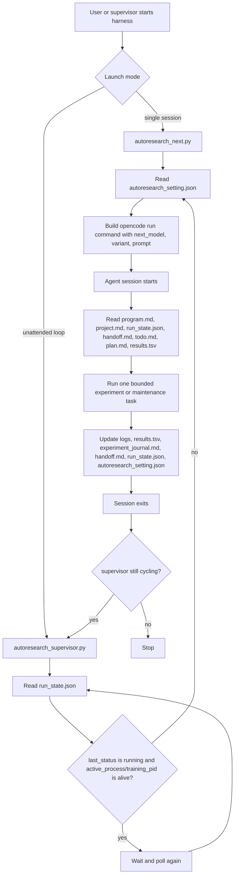

# autoresearch Template

This folder contains a reusable autoresearch loop for running iterative
experiments across multiple agent sessions.

## Files

- `program.md`: reusable workflow rules.
- `project.md`: project-specific objective, metrics, commands, and constraints.
- `plan.md`: medium-term experiment strategy.
- `todo.md`: short-term task queue.
- `handoff.md`: concise state for the next session.
- `experiment_journal.md`: detailed experiment history.
- `run_state.json`: machine-readable current state.
- `autoresearch_setting.json`: next model, reasoning effort, and startup prompt.
- `results.tsv`: compact result table.

## Workflow

Different from the original
[Autoresearch](https://github.com/karpathy/autoresearch), this template uses
short `opencode run` sessions plus explicit state files. The goal is to keep
each agent context small while preserving enough handoff state for the next
session.

The current harness has two launch modes:

- `scripts/autoresearch_next.py`: launches exactly one next `opencode run`
  from `autoresearch_setting.json`.
- `scripts/autoresearch_supervisor.py`: repeats the same launch step, but first
  checks `run_state.json` and waits if the previous session recorded an active
  long-running process. New state should use `active_process`; `training_pid`
  is still read only for older state files.
- `scripts/autoresearch_tui.py`: opens a read-only terminal dashboard for
  current status, todo items, recent results, and the latest log tail.



In practice, every session should end by synchronizing the files that the next
session will read. `run_state.json` is the machine-readable status, `handoff.md`
is the human-readable summary, and `autoresearch_setting.json` controls the
next model, reasoning effort, and startup prompt. If the supervisor finds a
recorded process that no longer exists, it marks the state as stopped and
records the stale pid before launching the next session.

## Usage

1. Copy this folder into a project.
2. Edit `project.md` for that project.
3. Set the first task in `todo.md`.
4. Run one session:

```bash
uv run python scripts/autoresearch_next.py
```

For unattended cycling, use:

```bash
uv run python scripts/autoresearch_supervisor.py
```

To observe a run without changing state, use:

```bash
python3 scripts/autoresearch_tui.py
```

The TUI also accepts user control events:

- `s`: queue a suggestion for the next `opencode run`.
- `S`: queue a suggestion and interrupt the current recorded session/process.
- `f`: queue a finish request for the next run; the supervisor stops after
  that run exits.
- `F`: queue a finish request and interrupt the current recorded
  session/process.
- `q`: quit the TUI only.

Control events are stored in `autoresearch/inbox.jsonl` and are appended to the
next launch prompt before that run starts.

The supervisor waits for `run_state.json.active_process.pid` when a long job is
running, with read-only compatibility for the older `training_pid` field. If no
active process is alive, it launches the next configured session.
