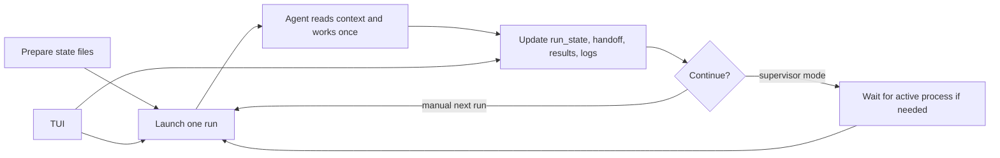

# autoresearch Template

This folder contains a reusable autoresearch loop for running iterative
experiments across multiple agent sessions.

## Files

- `program.md`: reusable workflow rules.
- `project.md`: project-specific objective, metrics, commands, and constraints.
- `plan.md`: medium-term experiment strategy.
- `todo.md`: short-term task queue.
- `handoff.md`: concise state for the next session.
- `experiment_journal.md`: detailed experiment history.
- `run_state.json`: machine-readable current state.
- `autoresearch_setting.json`: next model, reasoning effort, and startup prompt.
- `results.tsv`: compact result table.

## Workflow

Different from the original
[Autoresearch](https://github.com/karpathy/autoresearch), this template uses
short `opencode run` sessions plus explicit state files. The goal is to keep
each agent context small while preserving enough handoff state for the next
session.

The current harness has three main entry scripts:

- `scripts/autoresearch_next.py`: launches exactly one next `opencode run`
  from `autoresearch_setting.json`. Use this when you want one bounded agent
  session and prefer to decide manually when to start the next one.
- `scripts/autoresearch_supervisor.py`: repeats the same launch step, but first
  checks `run_state.json` and waits if the previous session recorded an active
  long-running process. New state should use `active_process`; `training_pid`
  is still read only for older state files. Use this when you want the loop to
  continue unattended across many short agent sessions.
- `scripts/autoresearch_tui.py`: opens a terminal dashboard for current status,
  todo items, recent results, and the latest log tail. It does not launch runs
  by itself, but it can queue user control events for the next run and can
  optionally interrupt the currently recorded session or process.



In practice, every session should end by synchronizing the files that the next
session will read. `run_state.json` is the machine-readable status, `handoff.md`
is the human-readable summary, and `autoresearch_setting.json` controls the
next model, reasoning effort, and startup prompt. If the supervisor finds a
recorded process that no longer exists, it marks the state as stopped and
records the stale pid before launching the next session.

## Usage

1. Copy this folder into a project.
2. Edit `project.md` for that project.
3. Set the first task in `todo.md`.
4. Run one session:

```bash
uv run python scripts/autoresearch_next.py
```

For unattended cycling, use:

```bash
uv run python scripts/autoresearch_supervisor.py
```

To observe a run without changing state, use:

```bash
python3 scripts/autoresearch_tui.py
```

The TUI also accepts user control events:

- `s`: queue a suggestion for the next `opencode run`.
- `S`: queue a suggestion and interrupt the current recorded session/process.
- `f`: queue a finish request for the next run; the supervisor stops after
  that run exits.
- `F`: queue a finish request and interrupt the current recorded
  session/process.
- `q`: quit the TUI only.

Control events are stored in `autoresearch/inbox.jsonl` and are appended to the
next launch prompt before that run starts.

The supervisor waits for `run_state.json.active_process.pid` when a long job is
running, with read-only compatibility for the older `training_pid` field. If no
active process is alive, it launches the next configured session.

## Script Details

### `scripts/autoresearch_next.py`

This is the simplest entry point. It reads `autoresearch_setting.json`, builds
one `opencode run` command, appends any pending user control events from
`autoresearch/inbox.jsonl`, and starts exactly one session.

Use it when:

- you want one manual iteration;
- you are debugging prompts or model settings;
- you want to inspect the exact launch command with `--dry-run`.

Useful flags:

- `--settings`: load a different settings file.
- `--prompt`: temporarily override the prompt in
  `autoresearch_setting.json`.
- `--dry-run`: print the final command without starting the agent.

### `scripts/autoresearch_supervisor.py`

This is the unattended loop runner. It repeatedly decides whether the next
agent session should start now or wait.

Its main responsibilities are:

- read `run_state.json` before every cycle;
- detect whether `active_process.pid` is still alive;
- mark stale recorded processes as stopped if the pid is already gone;
- launch the next `opencode run` when the project is idle;
- write per-session logs into `autoresearch/sessions/`;
- stop cleanly when a queued `finish` control event asks it to stop after the
  next run.

Use it when:

- training or evaluation jobs may continue after an agent session exits;
- you want many short agent sessions without manually relaunching each one;
- you want the loop to self-recover from stale recorded pids.

Useful flags:

- `--poll-seconds`: how often to re-check a recorded active process.
- `--max-cycles`: cap the number of launched sessions.
- `--stop-on-error`: stop immediately if one session exits non-zero.
- `--dry-run`: show what would happen without launching anything.

### `scripts/autoresearch_tui.py`

This starts the curses-based terminal dashboard defined in `scripts/tui/`. It
refreshes once per second and gives you one place to watch the loop without
editing JSON or Markdown files manually.

What it shows:

- current state from `run_state.json`;
- the currently relevant pid and whether it is alive;
- current branch, best FID, best proxy FID, and best checkpoint if those fields
  exist in state;
- visible items from `todo.md`;
- recent rows from `results.tsv`;
- the tail of the newest log from `autoresearch/sessions/` or
  `autoresearch/logs/`;
- count of pending user control events not yet consumed.

What it can do:

- `s`: queue a suggestion for the next agent run;
- `S`: queue a suggestion and also try to interrupt the currently recorded
  session or active process;
- `f`: queue a finish request so the next run does a final sync pass and the
  supervisor stops after that run;
- `F`: queue a finish request and also try to interrupt the current recorded
  session or active process;
- `q`: close the TUI itself.

The important boundary is that the TUI does not directly rewrite the main
workflow files like `todo.md`, `handoff.md`, or `results.tsv`. It mainly reads
state for display, writes control events into `autoresearch/inbox.jsonl`, and
in force mode sends `SIGTERM` to pids recorded in `run_state.json`.

### `scripts/autoresearch_control.py`

This is the control-event layer shared by the TUI and the launch scripts.

It is responsible for:

- storing queued user events in `autoresearch/inbox.jsonl`;
- marking events as consumed once a launch script applies them;
- rendering pending events into extra prompt text for the next agent run;
- deciding whether a pending `finish` event means the supervisor should stop
  after the next session;
- interrupting recorded pids when a force event is requested.

You normally do not run this file directly. It exists so the TUI, one-shot
launcher, and supervisor all use the same event format and the same interrupt
logic.

### `scripts/autoresearch_common.py`

This file contains shared helpers used by the other entry scripts.

It handles:

- locating project-level defaults such as `run_state.json` and
  `autoresearch_setting.json`;
- loading and writing JSON files;
- normalizing model aliases;
- validating reasoning effort values;
- building the final `opencode run` command;
- formatting that command for logging or `--dry-run`.

If you need to change how commands are assembled, this is the shared place to
do it.

### `scripts/tui/`

This directory contains the internal implementation of the TUI:

- `app.py`: curses event loop, layout, key handling, and refresh cycle.
- `snapshot.py`: reads project files and builds one compact snapshot for the
  renderer.
- `render.py`: draws status, todo, results, and log panels safely in the
  terminal.

You usually only run `scripts/autoresearch_tui.py`, but these files are where
you would modify layout, displayed fields, or keyboard behavior.
