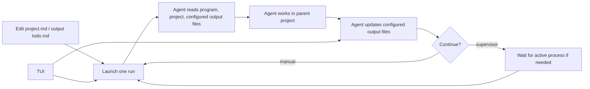

# myautoresearch

`myautoresearch` is a reusable autoresearch harness meant to live inside an
existing project as a subdirectory.

It is inspired by [karpathy's autoresearch](https://github.com/karpathy/autoresearch)
and wraps the same iterative idea with explicit context files, launch settings,
session handoff, and lightweight process supervision.

Typical layout:

```text
host-project/
  myautoresearch/
    program.md
    project.md
    autoresearch.config.json
    next_run.json
    scripts/
  autoresearch_output/
    run_state.json
    results.tsv
    autoresearch/
  src/
  ...
```

The harness code and stable project contract stay under `myautoresearch/`.
Runtime state, logs, and result history can live in a configured output
directory such as `autoresearch_output/`, while the agent works in the parent
project directory.

## Contents

- [Get Started](#get-started)
- [Files To Edit](#files-to-edit)
- [Init Templates](#init-templates)
- [State Files](#state-files)
- [Supervisor And TUI](#supervisor-and-tui)
- [Configuration](#configuration)
- [Next Run](#next-run)
- [Run Logic](#run-logic)

## Get Started

From an existing project root:

```bash
git clone <repo-url> myautoresearch
```

Edit the project-specific files yourself, or ask an agent to fill them in:

- `myautoresearch/project.md`: objective, metric, commands, protected files.
- The configured output `todo.md`: first concrete task, if needed.
- `myautoresearch/autoresearch.config.json`: paths or model defaults, if the
  defaults are not enough.

```bash
python3 myautoresearch/scripts/init_harness.py
python3 myautoresearch/scripts/autoresearch_next.py --dry-run
python3 myautoresearch/scripts/autoresearch_next.py
```

Use `scripts/autoresearch_supervisor.py` instead when you want the loop to keep
starting new sessions after the previous one finishes.

## Files To Edit

For a new project, usually edit only these files:

- `project.md`: project objective, metric, commands, protected files, and output
  paths.
- The configured output `todo.md`: the first concrete task, if the default task
  is not enough.
- `autoresearch.config.json`: workspace path, file names, or default model
  settings.
- `opencode.json`: permission rules, if the project has files that need hard
  protection.

Do not normally edit `program.md` directly. Edit `templates/program.md.in` for
workflow text that should apply to future generated copies, or edit
`autoresearch.config.json` for install-time options.

## Init Templates

`program.md` is generated from `templates/program.md.in` by
`scripts/init_harness.py`. The template uses simple `{{NAME}}` placeholders and
the script performs one-time text replacement during init/install. The generated
`program.md` is ordinary Markdown; runtime agents should not see unresolved
template placeholders.

Run this after changing install-time options in `autoresearch.config.json`:

```bash
python3 myautoresearch/scripts/init_harness.py
```

Use check mode in CI or before committing template changes:

```bash
python3 myautoresearch/scripts/init_harness.py --check
```

Keep frequently changing project details in `project.md`. Keep machine-readable
runtime settings in `autoresearch.config.json`.

## State Files

- `program.md`: generic autoresearch process and operating rules.
- `project.md`: project-specific contract.
- Configured output `next_run.json`: model, reasoning effort, prompt, and task
  for the next agent session.
- Configured output `run_state.json`: machine-readable current state.
- Configured output `handoff.md`: short human-readable handoff.
- Configured output `plan.md`: medium-term strategy.
- Configured output `todo.md`: short-term task queue.
- Configured output `experiment_journal.md`: detailed attempt history.
- Configured output `results.tsv`: compact result table.
- Configured output `autoresearch/logs/`: project command logs.
- Configured output `autoresearch/sessions/`: `opencode run` session logs.
- Configured output `autoresearch/tmp/`: disposable scratch files.

## Supervisor And TUI

The supervisor and TUI communicate through the configured output files. The TUI
is not the process manager and does not need to stay open.

Run the supervisor in a persistent shell, `tmux`, or the background:

```bash
python3 myautoresearch/scripts/autoresearch_supervisor.py
```

Open the TUI only when you want to inspect status, tail recent logs, or queue a
control event:

```bash
python3 myautoresearch/scripts/autoresearch_tui.py
```

TUI keys:

- `s`: queue a suggestion for the next run.
- `S`: queue a suggestion and interrupt the recorded session or process.
- `f`: queue a finish request for the next run.
- `F`: queue a finish request and interrupt the recorded session or process.
- `q`: quit the TUI.

Closing the TUI does not stop the supervisor or any recorded project process.
Force actions work by reading pids from `run_state.json` and sending a signal.

## Configuration

`autoresearch.config.json` controls paths and defaults:

```json
{
  "workspace_dir": "..",
  "state_dir": ".",
  "output_dir": "../autoresearch_output",
  "agent": {
    "command": "opencode",
    "default_model": "deepseekv4flash",
    "default_reasoning_effort": "xhigh",
    "available_models": {
      "deepseekv4pro": "deepseek/deepseek-v4-pro",
      "deepseekv4flash": "deepseek/deepseek-v4-flash"
    },
    "available_efforts": ["medium", "high", "xhigh", "max"]
  },
  "experiment": {
    "time_budget_minutes": 5,
    "timeout_minutes": 10,
    "branch_mode": "direction",
    "branch_cleanup": "suggest"
  },
  "termination": {
    "mode": "manual",
    "results_file": "results",
    "metric_column": "primary_metric",
    "target": null,
    "scale": "unit",
    "eligible_statuses": ["keep", "continue"],
    "finalize_with_agent": true
  },
  "supervisor": {
    "opencode_timeout_seconds": 3600,
    "active_process_stale_seconds": 7200,
    "kill_grace_seconds": 15
  },
  "files": {
    "program": "program.md",
    "project": "project.md",
    "state": "run_state.json",
    "todo": "todo.md",
    "plan": "plan.md",
    "handoff": "handoff.md",
    "journal": "experiment_journal.md",
    "results": "results.tsv",
    "next_run": "next_run.json",
    "inbox": "autoresearch/inbox.jsonl"
  }
}
```

`workspace_dir` is resolved relative to `myautoresearch/`. The default `..`
means the agent runs from the parent project directory.

`output_dir` is resolved relative to `myautoresearch/` and is the preferred
base for runtime files: `run_state.json`, `handoff.md`, `todo.md`, `plan.md`,
`experiment_journal.md`, `results.tsv`, `next_run.json`,
`autoresearch/inbox.jsonl`, and the `autoresearch/logs`,
`autoresearch/sessions`, and `autoresearch/tmp` directories. Set it to
`../autoresearch_output` when the host repository should track useful
autoresearch output. `state_dir` remains as a legacy fallback for older configs
that do not set `output_dir`.

`agent.available_models` maps short aliases to the model names passed to
`opencode run -m`. Unknown model names are passed through as raw model names.
`agent.available_efforts` controls which reasoning variants are accepted by the
launcher and rendered into `program.md`.

`experiment.time_budget_minutes` and `experiment.timeout_minutes` are rendered
into `program.md` during init. `branch_mode: "direction"` means new research
directions should get their own `autoresearch/<tag>-<direction>` branch, while
small follow-up tweaks stay on the current direction branch. `branch_cleanup:
"suggest"` means agents should list cleanup candidates instead of deleting
branches automatically.

`termination.mode: "target"` makes `autoresearch_supervisor.py` check
`results.tsv` before each new session. When the best numeric value in
`metric_column` reaches `target`, using only `eligible_statuses`, the supervisor
queues the same non-force `finish` event used by the TUI. The next agent session
performs final synchronization and the supervisor exits after that session. Use
`scale: "percent"` when both the target and result values are written as `85`
instead of `0.85`.

`supervisor.opencode_timeout_seconds` limits each `opencode run` session that
the supervisor starts. `supervisor.active_process_stale_seconds` limits how long
a recorded project process may go without updating state before it is treated as
stalled. In both cases, `supervisor.kill_grace_seconds` is the delay between
`SIGTERM` and `SIGKILL`.

## Next Run

The configured output `next_run.json` is the launch plan for the next agent
session:

```json
{
  "next_model": "deepseekv4flash",
  "next_reasoning_effort": "xhigh",
  "expected_work_type": "setup",
  "next_task": "Inspect the parent project and prepare the first concrete research task.",
  "reason": "A new harness should understand the host project first.",
  "prompt": "Read myautoresearch/program.md first...",
  "updated_at": "2026-05-14T00:00:00+08:00"
}
```

The scripts still fall back to the old `autoresearch_setting.json` name if
`next_run.json` is missing, but new projects should use the configured output
`next_run.json`.

## Run Logic

The harness is a small file-based loop around short `opencode run` sessions:



`autoresearch_next.py` launches exactly one configured session from the
configured output `next_run.json`.

`autoresearch_supervisor.py` repeats that launch step. Before each cycle, it
reads `run_state.json`; if `active_process.pid` is alive and `last_status` is
`running`, it waits. Otherwise it launches the next session and writes a log
under the configured output `autoresearch/sessions/`.

`autoresearch_tui.py` reads the same state files and log files. It can also
append user control events to the configured output `autoresearch/inbox.jsonl`;
the next launch folds those events into the agent prompt.

Long-running project jobs should be recorded in this shape:

```json
{
  "active": true,
  "last_status": "running",
  "active_process": {
    "pid": 12345,
    "kind": "training",
    "log_path": "autoresearch_output/autoresearch/logs/run.log",
    "expected_output": "path/to/artifact",
    "started_at": "2026-05-14T00:00:00+08:00"
  }
}
```
